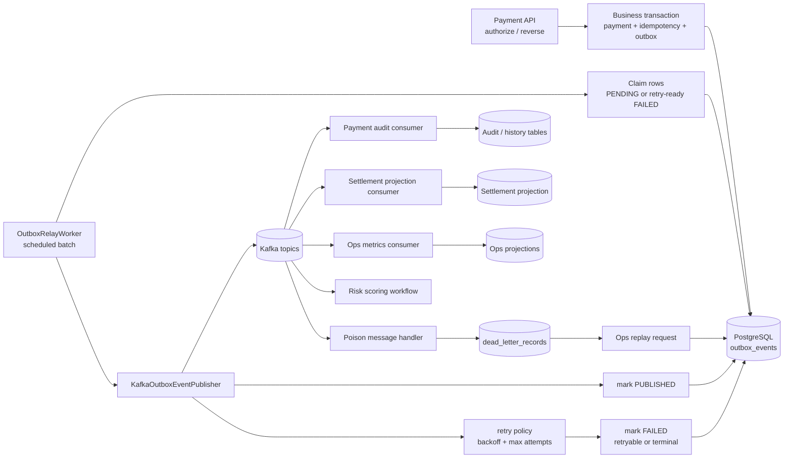
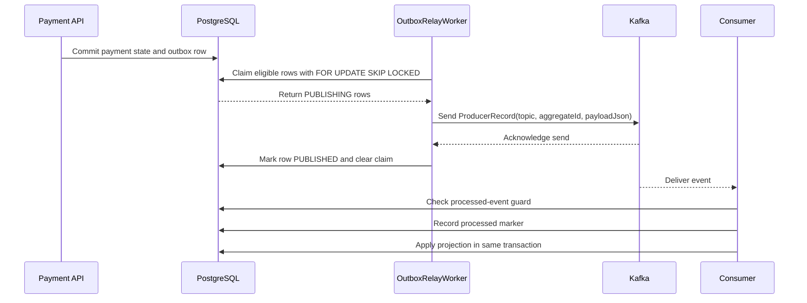
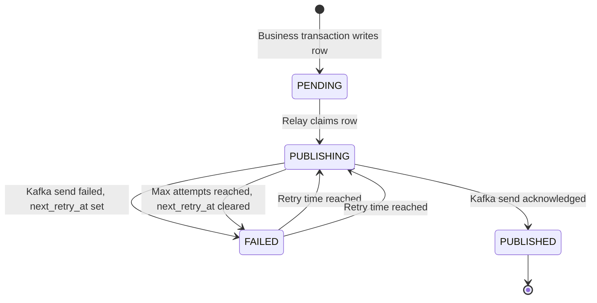

# Phase 6: Messaging And Event APIs

## Purpose

Phase 6 turns the durable outbox rows from earlier phases into real asynchronous platform events.

In plain terms, this phase answers:

```text
After a payment workflow commits to the database, how do we safely publish events, consume them once, build downstream
read models, handle poison messages, and let operators replay failures?
```

This phase is not only "send Kafka messages." It defines how the platform communicates between services without losing
events, duplicating business effects, or hiding failures from operators.

## Product Behavior We Are Building

The platform already writes outbox rows during payment authorization, reversal, and replay audit workflows. Phase 6 adds
the machinery around those rows:

1. A relay claims eligible outbox rows.
2. The relay publishes each row to Kafka using the configured topic.
3. The relay marks rows as `PUBLISHED` after Kafka acknowledges the send.
4. Publish failures move rows back to `FAILED` while preserving the original payload.
5. Consumers process Kafka events idempotently.
6. Bad messages become dead-letter records instead of crashing consumers forever.
7. Operations APIs can inspect failures and request replay.
8. RabbitMQ callback commands are prepared for partner webhook delivery.

The first implemented slice of Phase 6 covers event envelope contracts, Kafka topic configuration, relay query/claiming,
Kafka publish mapping, the scheduled relay worker, producer retry decisions, failure marking, and consumer idempotency
markers.

## Architecture Picture



## Event Flow



## Outbox Relay State Model



## Current Implemented Slice

### Event Envelope

All business events use a stable envelope with:

- `eventId`
- `schemaVersion`
- `eventType`
- `aggregateId`
- `aggregateType`
- `occurredAt`
- `producer`
- `correlationId`
- `payload`

The contract is documented in `docs/events/event-envelope.md` and represented in code by `EventEnvelope`.

### Kafka Topics

Topic ownership is documented in `docs/events/kafka-topics.md`.

Configured topics:

| Topic                             | Main producer        | Main consumers         | Partition key                     |
|-----------------------------------|----------------------|------------------------|-----------------------------------|
| `payment.authorization.requested` | payment orchestrator | risk scoring, audit    | `paymentId`                       |
| `risk.score.completed`            | risk scoring         | payment orchestrator   | `paymentId`                       |
| `payment.authorization.completed` | payment orchestrator | audit, settlement, ops | `paymentId`                       |
| `payment.reversal.completed`      | payment orchestrator | audit, settlement, ops | `paymentId`                       |
| `platform.dead-letter.recorded`   | dead-letter handler  | ops                    | original event ID or aggregate ID |

### Outbox Relay Query

The relay candidate query selects:

- rows with `status = 'PENDING'`;
- rows with `status = 'FAILED'` and `next_retry_at <= now`;
- oldest rows first by `created_at`;
- at most the configured batch size;
- rows not locked by another transaction when PostgreSQL `SKIP LOCKED` is used.

### Claiming

Claiming changes eligible rows to `PUBLISHING` and stores:

- `locked_at`
- `relay_instance_id`

This avoids two relay workers publishing the same row in normal concurrent operation. The relay uses `FOR UPDATE SKIP
LOCKED` so one worker can keep moving while another worker holds locks.

### Kafka Publishing

The Kafka publisher:

- maps outbox `eventType` to a configured Kafka topic;
- uses `aggregateId` as Kafka key for ordering by payment;
- sends `payloadJson` as-is without reserializing it;
- adds useful headers such as `event_id`, `event_type`, `schema_version`, `aggregate_id`, `aggregate_type`, and
  `correlation_id`.

### Relay Worker

`OutboxRelayWorker` is scheduled but disabled by default:

```yaml
payment-risk:
  outbox:
    relay:
      enabled: false
      batch-size: 50
      fixed-delay-millis: 5000
      instance-id: ${HOSTNAME:payment-orchestrator-service}
      max-attempts: 5
      initial-backoff-millis: 1000
      max-backoff-millis: 60000
```

When enabled, one batch does:

```text
claim eligible rows -> publish event -> mark PUBLISHED
                         |
                         +-> on error, retry policy -> mark FAILED
```

The worker continues after a partial failure so one bad publish does not stop the whole batch.

### Producer Retry Policy

`OutboxProducerRetryPolicy` decides what happens after Kafka publish fails.

The policy:

- increments `retry_count`;
- computes exponential backoff from `initialBackoffMillis`;
- caps delay at `maxBackoffMillis`;
- marks terminal failure when `maxAttempts` is reached.

Terminal failures still use outbox status `FAILED`, but `next_retry_at` is cleared. That distinction matters:

- `FAILED` with `next_retry_at` set means the relay can retry later;
- `FAILED` with `next_retry_at = NULL` means operators must inspect or replay manually.

### Consumer Idempotency

Kafka can deliver the same event more than once. Phase 6 adds a processed-message marker table:

```text
processed_kafka_messages
```

Each marker stores:

- consumer name;
- topic;
- partition;
- offset;
- event ID;
- processed timestamp.

Two unique constraints protect idempotency:

- one consumer can process a given `event_id` once;
- one consumer can process a given Kafka `(topic, partition, offset)` once.

`IdempotentConsumerGuard` records the marker and runs projection work inside one transaction. Marker insert happens
before projection work. If another consumer already inserted the marker, projection work is skipped. If projection work
fails,
the transaction rolls back the marker so Kafka retry can try again.

### Payment Audit Projection

`KafkaPaymentAuditConsumer` consumes final payment lifecycle events:

- `PaymentAuthorized`
- `PaymentDeclined`
- `PaymentReversed`

It validates the envelope schema version, preserves `correlationId` and `occurredAt`, then stores an append-only history
row in `payment_audit_events`.

The audit table is indexed by:

- `event_id` for idempotency and traceability;
- `payment_id` for payment history lookup;
- `occurred_at` and `(payment_id, occurred_at)` for ordered timelines.

### Settlement Projection

`KafkaSettlementProjectionConsumer` consumes authorization and reversal outcomes and writes `settlement_projections`.

Projection behavior:

- `PaymentAuthorized` creates or updates a `SETTLEMENT_READY` row;
- `PaymentDeclined` creates or updates a `NOT_SETTLED` row;
- `PaymentReversed` moves the row to `REVERSED`.

The projection stores merchant, customer, amount, currency, last event metadata, correlation ID, and UTC
`business_date`.
Indexes support settlement batches by merchant, status, and business date.

## Layer-By-Layer Design

### Application Layer

Files live under:

```text
services/payment-orchestrator-service/src/main/java/dev/kavrin/paymentrisk/outbox/application
```

The application layer owns relay workflow interfaces and scheduling:

- `OutboxRelayQuery`
- `OutboxRelayEventReader`
- `OutboxRelayEventClaimer`
- `OutboxEventPublisher`
- `OutboxRelayStatusUpdater`
- `OutboxRelayWorker`
- `OutboxRelayProperties`
- `OutboxProducerRetryPolicy`

It should not know about SQL details or Kafka client APIs.

### Infrastructure Persistence Layer

Files live under:

```text
services/payment-orchestrator-service/src/main/java/dev/kavrin/paymentrisk/outbox/infrastructure/persistence
```

This layer owns SQL and row mapping:

- selects relay candidates;
- claims rows with `FOR UPDATE SKIP LOCKED`;
- maps database rows to `OutboxEvent`;
- marks rows `PUBLISHED`;
- marks rows `FAILED`.

### Infrastructure Messaging Layer

Files live under:

```text
services/payment-orchestrator-service/src/main/java/dev/kavrin/paymentrisk/outbox/infrastructure/messaging
```

This layer owns Kafka adapter details:

- topic mapping;
- key selection;
- producer headers;
- `KafkaTemplate` bridging into Reactor.

## Failure Model

Phase 6 separates three failure types:

| Failure                                       | Current behavior                               | Later Phase 6 work                                               |
|-----------------------------------------------|------------------------------------------------|------------------------------------------------------------------|
| Kafka publish fails                           | row becomes `FAILED`, payload preserved        | ops replay execution for terminal failures                       |
| Consumer sees duplicate event                 | processed marker prevents duplicate projection | concrete audit/settlement/ops consumers will use this guard      |
| Consumer cannot deserialize or handle message | planned dead-letter record                     | poison-message handler and `platform.dead-letter.recorded` event |

## Why This Design

The design keeps database state as source of truth until Kafka acknowledges the send. That avoids this bug:

```text
Payment authorized in DB, process crashes before Kafka publish, downstream systems never learn about it.
```

The outbox relay makes that scenario recoverable because the event remains a database row until the relay publishes it.

`aggregateId` as Kafka key gives per-payment ordering. That matters because consumers should not see
`PaymentReversed` before `PaymentAuthorized` for the same payment.

`SKIP LOCKED` allows horizontal scaling. Multiple relay workers can run, and each worker claims different rows without
blocking the others.

## Remaining Phase 6 Work

Next slices should add:

- ops metrics consumer;
- poison-message dead-letter handling;
- RabbitMQ callback command contract and callback worker;
- replay execution from ops replay jobs;
- consumer lag adapter backed by real Kafka admin APIs.

## Verification

Focused verification for the implemented Phase 6 messaging slice:

```bash
cd services/payment-orchestrator-service
./mvnw -Dtest=OutboxRelayQueryTest,OutboxRelayWorkerTest,KafkaOutboxEventPublisherTest,DatabaseOutboxRelayEventReaderTest,DatabaseOutboxRelayClaimingTest test
./mvnw -Dtest=OutboxProducerRetryPolicyTest,OutboxRelayWorkerTest,ProcessedMessageCommandTest,IdempotentConsumerGuardTest test
./mvnw -Dtest=DatabaseOutboxRelayClaimingTest,DatabaseProcessedMessageStoreTest test
./mvnw -Dtest=KafkaPaymentAuditConsumerTest,KafkaSettlementProjectionConsumerTest test
./mvnw -Dtest=DatabasePaymentAuditProjectorTest,DatabaseSettlementProjectionProjectorTest test
```

The database-backed tests use Testcontainers PostgreSQL because row locking and `SKIP LOCKED` behavior must be verified
against real PostgreSQL.
